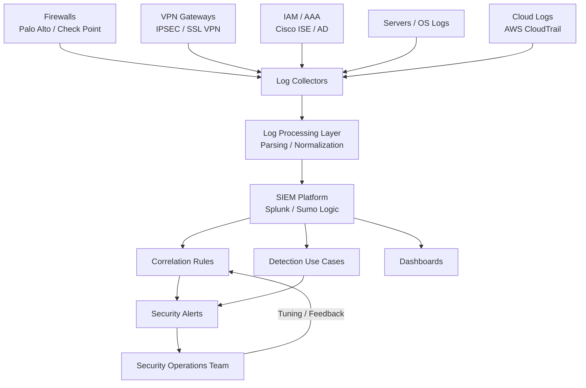

# 🔐 SIEM Detection Engineering & Log Pipeline Design

## 🔹 Overview
Designed and implemented a **security monitoring architecture** to improve detection visibility, log coverage, and incident response readiness across enterprise infrastructure.

Goal:
> Move from "logs exist" → to → "actionable security detection"

---

## 🔹 Problem Statement

The environment had multiple security tools (firewalls, VPN, IAM, servers), but:

- Logs were not centralized  
- No standardized log format or correlation  
- Detection use-cases were missing or incomplete  
- High noise, low signal (alert fatigue)  
- Limited visibility into user behavior  

**Impact:**
- Security incidents could go undetected  
- SOC lacked actionable insights  

---

## 🔹 Objectives

- Design centralized SIEM architecture  
- Build log ingestion pipeline  
- Create high-value detection use-cases  
- Reduce noise and improve signal quality  
- Enable incident response visibility  

---

## 🔹 Architecture Design

### Design Principles

- Collect logs from critical control points  
- Normalize → Correlate → Detect  
- Focus on identity + access behavior  
- Ensure logs are actionable  

---

## 🔹 SIEM Architecture Diagram

---

## 🔹 Log Pipeline Design
### Log Sources
- Firewalls (traffic, threat logs)
- VPN (user login, session activity)
- IAM / AAA (authentication, authorization)
- Windows/Linux systems
- Cloud logs (AWS)

---

## 🔹 Log Pipeline Design

### Log Sources

- Firewalls (traffic, threat logs)
- VPN (user login, session activity)
- IAM / AAA (authentication, authorization)
- Windows/Linux systems
- Cloud logs (AWS)

---

### Processing Flow

#### 1. Collection
- Syslog / API ingestion  

#### 2. Parsing
- Normalize fields (user, IP, action, timestamp)  

#### 3. Enrichment
- Geo-location  
- User identity  
- Asset criticality  

#### 4. Indexing
- Structured storage in SIEM  

---

## 🔹 Detection Use-Cases

### 1. VPN Anomaly Detection

**Logic:**
- Multiple login failures followed by success  
- Login from unusual geo-location  
- Concurrent sessions from different locations  

**Outcome:**
- Detect compromised credentials  

---

### 2. IAM / AAA Abuse Detection

**Logic:**
- Login outside business hours  
- Privilege escalation events  
- Access to restricted segments  

**Outcome:**
- Detect insider threat / misuse  

---

### 3. Firewall Threat Detection

**Logic:**
- Repeated deny logs from same source  
- Known malicious IP communication  
- Unusual east-west traffic  

**Outcome:**
- Detect scanning and lateral movement  

---

### 4. Lateral Movement Detection

**Logic:**
- Multiple internal connections across segments  
- Abnormal access patterns  

---

## 🔹 Dashboards

- VPN activity trends  
- Authentication success/failure  
- Firewall deny/allow trends  
- Suspicious IP tracking  

---

## 🔹 Security Improvements

- Centralized log visibility  
- Reduced alert noise  
- Real-time threat detection  
- Improved SOC response  
- Behavior-based detection capability  

---

## 🔹 Challenges & Solutions

- **High log volume**  
  → Filtering and prioritization  

- **False positives**  
  → Rule tuning and thresholds  

- **Lack of context**  
  → Enrichment (user, geo, asset)  

---

## 🔹 Lessons Learned

- Detection should focus on behavior  
- Logs without context have low value  
- SIEM success depends on use-cases, not tools  
- Identity logs are most critical  

---

## 🔹 Future Enhancements

- UEBA (User Behavior Analytics)  
- SOAR integration  
- EDR/XDR integration  
- Threat intelligence feeds  

---

## 🔹 Tools & Technologies

- SIEM: Splunk / Sumo Logic  
- Log ingestion: Syslog, API  
- Firewalls: Palo Alto / Check Point  
- IAM: Cisco ISE, Active Directory  
- Cloud: AWS  
